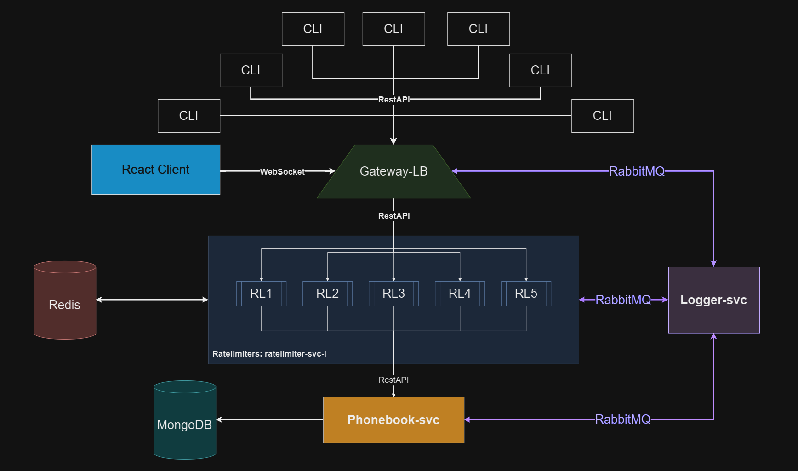
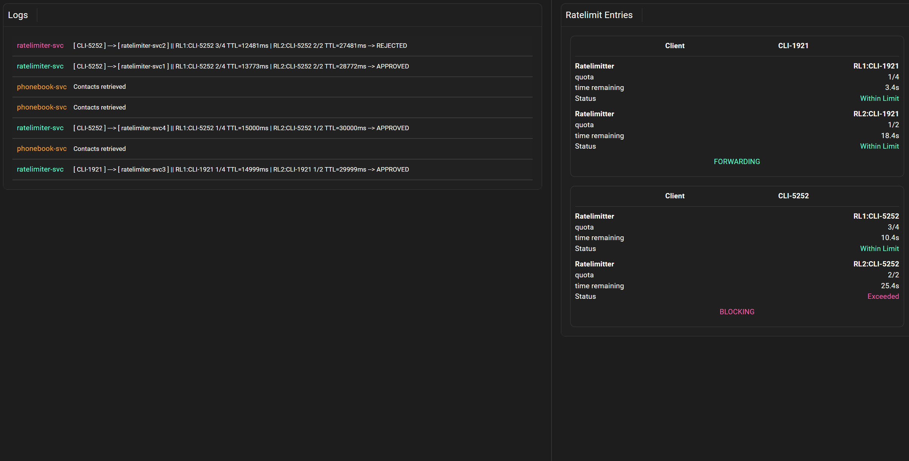
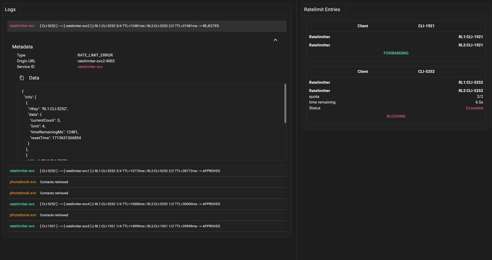

# # Project Architecture Overview

This project is designed to efficiently manage and handle high volumes of traffic directed towards a specific service by leveraging multiple rate limit services.

The rate limit services are deployed to prevent any single service from being overwhelemd with too many requests, thereby maintaining the overall system performance and stability. 
The diagram below provides a visual representation of the project architecture:




# Installation:
Use the docker-compose.yml file provided in the root folder of the repository.
Preferbly use the command
```vim
docker-compose up 
```
If you don't have docker compose, you can install it using:
```vim
sudo apt-get update
sudo apt-get install docker-compose-plugin
```
## Note1 
Make sure the following ports are available:
```
gateway-lb-svc:      3000
ratelimiter-svc-i:   4000,4001,4002,4003,4004
logger-svc:          4500
phonebook-svc:       5000
fe-svc:              7000
mongodb:             27017
redis:               6379
rabbitmq:            5672
```
## Note2

After running
```vim 
docker-compose up
```
It takes time for all services to be ready, and as such, the gateway-lb, which initiates a healthcheck polling on startup, wont allow any requests to pass through and will respond 
with an error saying which services are up. It takes about 30 seconds for all services to become ready.


# How the Ratelimiters work:
The environment has ratelimit-instances and ratelimit-services
```
ratelimit-instance: the mechanism configured globally to limit x-requests in a timewindow of y-seconds
ratelimit-svc-i: the actual contained service that is recieving requests from the gateway-lb 
``` 

#

- The gateway recieves a response
- It forwards request using roundrobin to any of  ratelimiters known to it (provided by docker-compose env variables, or a single one on port 4000 if none provided)
- A Ratelimiter recieves a request
  - It looks for the header x-client-id to get ***clientId***
  - A key is generated:
  - ```bash
    key = rl$i:${clientId}
    where rl-i is the index of the ratelimit-instance (not the container service)
    globally, there may be any number of ratelimit instances, which configure how many messages can go through within a given timewindow.
    An example for a key given client id CLI-2555 is: ${RL-1:CLI-2555}
    ```
  - Next, the ratelimiter-svc allows the request to go through ONLY if all the ratelimit-instances approved the request
  - Otherwise, it blocks the request and responds to the gateway with the appropriate error 
--- 
# API:
Contact Model Definition:
```js
IContact = {
    "firstName":string,
    "lastName":string,
    "phone":string,
    "address":string
}
```
#

### Add Contact to the Database:
```js
POST /api/contacts
```
### Example:
```js
curl -X POST 'http://localhost:3000/api/contacts' \
  -H 'Content-Type: application/json' \
  -H 'x-client-id: your-client-id' \
  -d '{
    "firstName": "John",
    "lastName": "Doe",
    "phone": "1234567890",
    "address": "123 Elm St"
  }'
```
### Response:
```js
IContact if exists else returns 404
```
#
### Get Contacts from the Database
This will get the contacts according to the page and limit (page size) you provide.

Note the limit is capped at 10. Providing a limit value higher than 10 will default to a 10 contacts page size.
```js
GET /api/contacts?page=1&limit=10
```
### Example:
```js
curl -X GET 'http://localhost:3000/api/contacts?page=1&limit=10' -H 'x-client-id: CLI-5029'
```
### Response:
```js
Array of IContacts found according to provided Page size and Limit values
```

#
### Edit existing Contact by ID:
This will update the contact's field according to the fields you provide in the body.
```js
PUT /api/contacts:id
```
### Example:
```js
curl -X PUT 'http://localhost:3000/api/contacts/:id' \
  -H 'Content-Type: application/json' \
  -H 'x-client-id: CLI-5029' \
  -d '{
    "firstName": "Jane",
    "lastName": "Smith",
    "phone": "9876543210",
    "address": "321 Maple St"
  }'
```


Response:
```js
Updated IContact
```
#
### Search contact by Query:
This will search for any contacts based on the **VALUE** of your query.
Our DB is indexed by the Contact Model text, and so, a user may search for a contact based on any of the model's fields.
### Example:
```bash
curl -X GET 'http://localhost:3000/api/contacts/search?q=John' \
  -H 'x-client-id: CLI-5029'

Response:
```js
Array of IContact
```


### The architecture consists of the following components
#
### - **MongoDB**: 
- Database service to handle the API functionality
## - **Redis**: 
- Handles rate limit keys according to x-client-id header and along with **Express** in order to handle ratelimits

## - **RabbitMQ**:
- Message broker for logging

## - **logger-svc**:
- Consumes RabbitMQ messages and provides the option to connect with a websocket to listen for new log messages. 

## - **gateway-lb**: This is the gateway and the main entry point of the architecture
  - It uses **round-robin** to forward requests to the ratelimiters present in the environment.
  - It also has a **HEALTHCHECK** mechanism to ensure no requests are forwarded to any other service unless the entire environment is ready
  - Logs anything of importance to RabbitMQ and logger-svc
## - **ratelimiter-svc-i**: 
  - This is a ratelimit service instance, there may be any number of them in the architecture. The **[ i ]** indicates its index
  - It is easily configureble, currently has 2 ratelimit instances with Redis.
  - The ratelimiter-svc allows requests to pass through it **ONLY IF ALL RATELIMITS APPROVED IT**
  - It recieves requests from the **gateway-lb** and modifies the headers with middlewares to provide extra information for logging
## - **phonebook-svc**:
  - Recieves the forwarded requests from **ratelimiter-svc-i** 
  - Handles API interaction and processes the API requests
  - Interacts with **MongoDB** to store relevant data according to API requirements

## - **fe-svc**:
  - Frontend engine, provides a GUI to monitor the architecture
  - Connected to **logger-svc** via websocket
  - On the left, a user may monitor the logs recieved
  - On the 





<br/>
<br/>

# Examples:
## Add Contact


# Services info

- **ratelimiter-svc1**
  - Port: 4001
  - URL: http://ratelimiter-svc1:4001

- **ratelimiter-svc2**
  - Port: 4002
  - URL: http://ratelimiter-svc2:4002

- **ratelimiter-svc3**
  - Port: 4003
  - URL: http://ratelimiter-svc3:4003

- **ratelimiter-svc4**
  - Port: 4004
  - URL: http://ratelimiter-svc4:4004

- **gateway-lb-svc**
  - Port: 3000
  - URL: http://gateway-lb-svc:3000

- **logger-svc**
  - Port: 4500
  - URL: http://logger-svc:4500

- **phonebook-svc**
  - Port: 5000
  - URL: http://phonebook-svc:5000

- **fe-svc**
  - Port: 7000
  - URL: http://fe-svc:7000

- **redis**
  - Port: 6379
  - URL: redis://redis:6379

- **mongodb**
  - Port: 27017
  - URL: mongodb://mongodb:27017

- **rabbitmq**
  - Port: 5672
  - URL: amqp://rabbitmq:5672